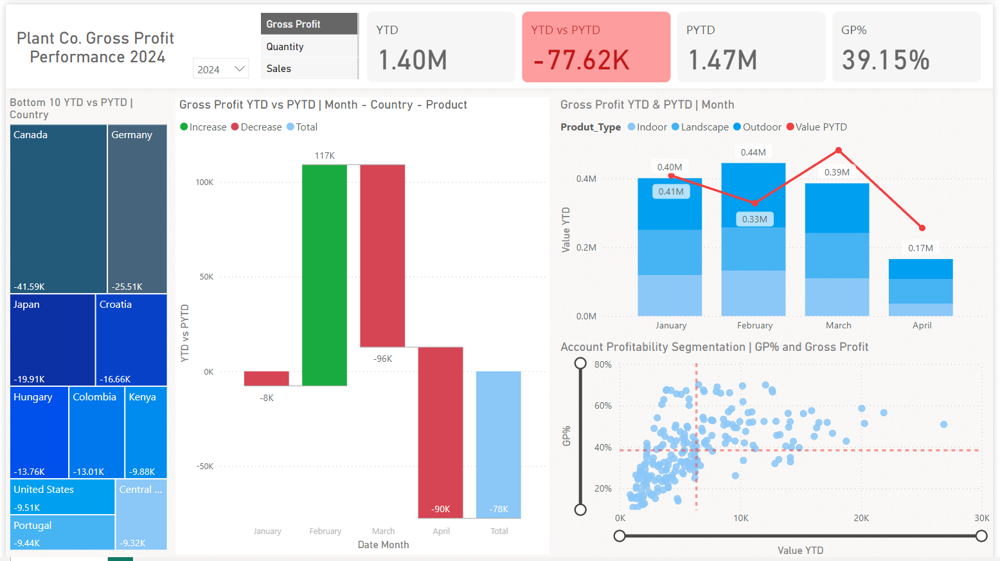
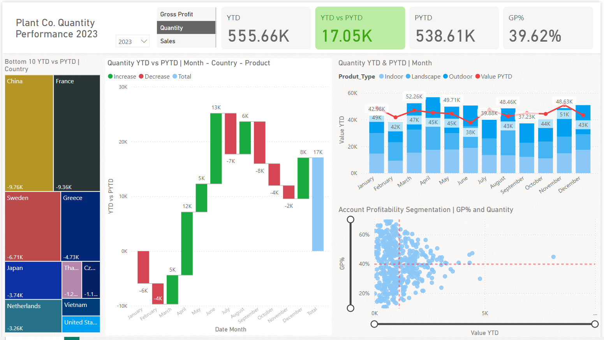
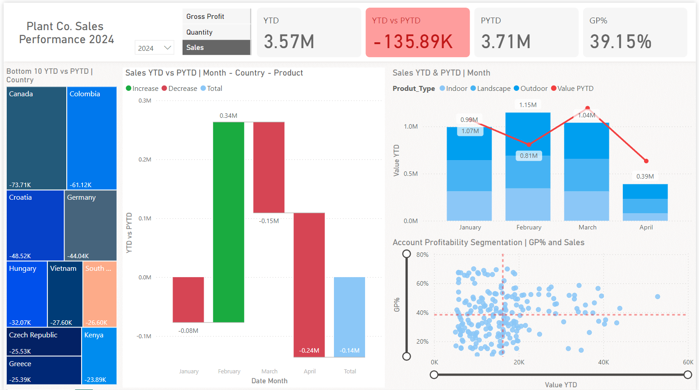

# Plant Co Performance Dashboard

## Overview

This PowerBI dashboard provides a comprehensive performance report for a fictional plant company. The dashboard focuses on three key metrics:
- Gross Profit
- Quantity of Products
- Product Sales

The data covers the years 2024, 2023, and 2022, and the dashboard allows for year-to-date (YTD) comparisons.

## Features

- **YTD Values and Comparisons**: The dashboard displays year-to-date values and compares them with the previous year-to-date.
- **Dynamic Slicers**: Two slicers are available to customize the view:
  - **Metric Slicer**: Allows users to select between Gross Profit, Quantity of Products, and Product Sales.
  - **Year Slicer**: Allows users to choose the year (2024 or 2023) for which they wish to see the YTD values.

## Dashboard Screenshots

### Gross Profit

### Quantity

### Sales

## How to Use

1. **Download the Repository**: Click on the green "Code" button on the GitHub repository page and select "Download ZIP". Extract the downloaded ZIP file to your local machine.

2. **Open the PowerBI File**: Locate the `plant_co_dashboard.pbix` file in the extracted folder and open it using PowerBI Desktop.

3. **Interact with the Dashboard**: Use the slicers to filter the data by metric and year. The visuals will update accordingly to reflect the selected filters.
